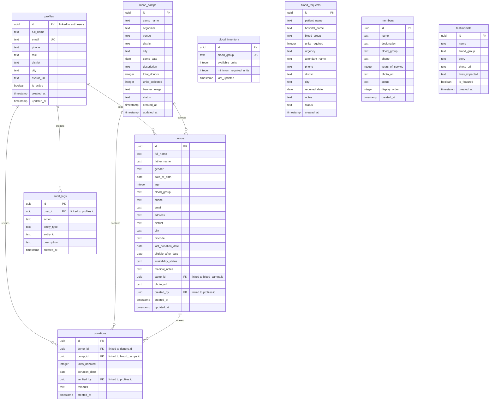

# Supabase Setup & Vercel Deployment Guide

This document outlines the step-by-step instructions to initialize a new Supabase database, execute SQL migrations, configure asset storage buckets, and deploy the NGO Blood Bank Portal to Vercel.

---

## 📊 Database Entity-Relationship (ER) Diagram



---

## 🚀 Step 1: Create a Supabase Project

1. Log in to the [Supabase Dashboard](https://supabase.com).
2. Click **New Project** and select your Organization.
3. Enter a project name (e.g. `Lifesaver NGO Blood Bank`).
4. Set a strong database password and choose your regional location (e.g. **Asia South - Mumbai** for India/Punjab).
5. Click **Create New Project** and wait for database provisioning.

---

## 💾 Step 2: Initialize Database Tables, Seeds, and Security Policies

We will run our database scripts in order inside the **SQL Editor** of the Supabase dashboard:

1. Click on **SQL Editor** from the left navigation panel of your Supabase project.
2. Click **New Query** to create an empty SQL worksheet.
3. Open `supabase_schema.sql` from your project root, copy the contents, paste them into the SQL Editor, and click **Run**. This establishes tables, constraint rules, triggers, and automated user profiles matching.
4. Create a second **New Query** worksheet. Copy the contents of `supabase_seed.sql`, paste them into the editor, and click **Run**. This fills the database with Punjab-specific donor directory rows, live camps records, inventory groups, testimonials, and mock emergency request listings.
5. Create a third **New Query** worksheet. Copy the contents of `supabase_policies.sql`, paste them into the editor, and click **Run**. This sets up the `public.check_user_role` validator function, configures Row-Level Security (RLS) on all tables, builds asset storage buckets (`avatars`, `donors`, `camps`, `members`), and secures them with RLS rules.

---

## 📁 Step 3: Verify Storage Bucket Settings

1. Select **Storage** in the left sidebar of your Supabase dashboard.
2. Confirm that four buckets have been created:
   - `avatars` (Public: Enabled)
   - `donors` (Public: Enabled)
   - `camps` (Public: Enabled)
   - `members` (Public: Enabled)
3. Click on the three dots next to each bucket, select **Edit Bucket**, and double check that **Public Bucket** is switched **ON** (necessary for loading images directly into the frontend React components).

---

## 🔑 Step 4: Configure Local Development Environment

1. Rename the `.env.example` file in your project root to `.env`:
   ```bash
   mv .env.example .env
   ```
2. Navigate to your Supabase project settings -> **API**.
3. Copy the **Project URL** and paste it as `VITE_SUPABASE_URL` inside your `.env` file.
4. Copy the **anon / public** API Key and paste it as `VITE_SUPABASE_ANON_KEY` inside your `.env` file.
5. Start the local server to verify connection:
   ```bash
   npm run dev
   ```

---

## ⚡ Step 5: Deploy to Vercel

1. Log in to [Vercel](https://vercel.com).
2. Click **Add New** -> **Project** and import your Git Repository.
3. Under **Framework Preset**, select **Vite**.
4. Expand **Environment Variables** and add the following keys from your `.env` file:
   - Name: `VITE_SUPABASE_URL`, Value: `[Your Supabase URL]`
   - Name: `VITE_SUPABASE_ANON_KEY`, Value: `[Your Supabase Anon Public Key]`
5. Click **Deploy**. Vercel will bundle the production build and deploy it with secure hosting and fast serverless routes.
